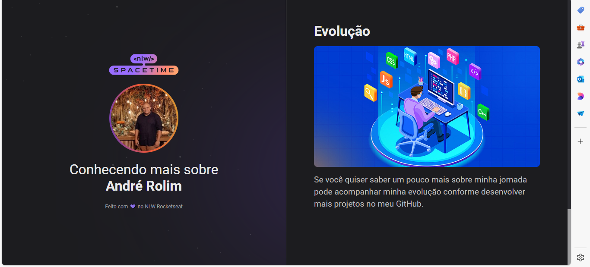

<h1 align="center"> Cápsula do tempo </h1>

Programa exclusivo e gratuito.  
<a href="https://www.linkedin.com/in/andr%C3%A9-rolim-b8271b207/">Conheça mais sobre esse e outros projetos clicando aqui.</a>

  <a href="#-tecnologias">Tecnologias</a>&nbsp;&nbsp;&nbsp;|&nbsp;&nbsp;&nbsp;
  <a href="#-projeto">Projeto</a>&nbsp;&nbsp;&nbsp;|&nbsp;&nbsp;&nbsp;
  <a href="#-layout">Layout</a>&nbsp;&nbsp;&nbsp;|&nbsp;&nbsp;&nbsp;
  

## 💻 projeto

Esse é um projeto web responsivo de uma capsula do tempo apara exibir memorias em uma linha do tempo. 
[Acesse o projeto finalizado, online.](https://andrerollim.github.io/ApresentcaoPessoal)

## 🚀 Tecnologias

- HTML
- CSS
- Git e Github

## Layout

Você pode vizualisar o layout do projeto através
[desse link](<https://www.figma.com/file/C5oGbyUg9VEemUBXQzQ5sc/C%C3%A1psula-do-tempo-%E2%80%A2-Trilha-Explorer-(Community)-(Copy)?type=design&node-id=306%3A84&t=DpzTiYvYPG14pkAA-1>).
É necessário ter uma conta no [Figma](https://www.figma.com/).
